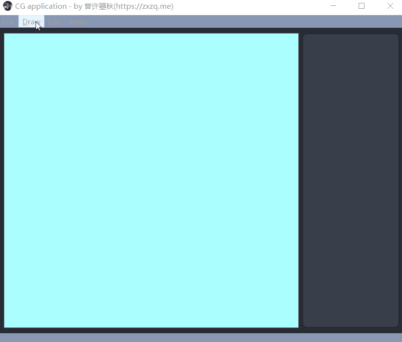
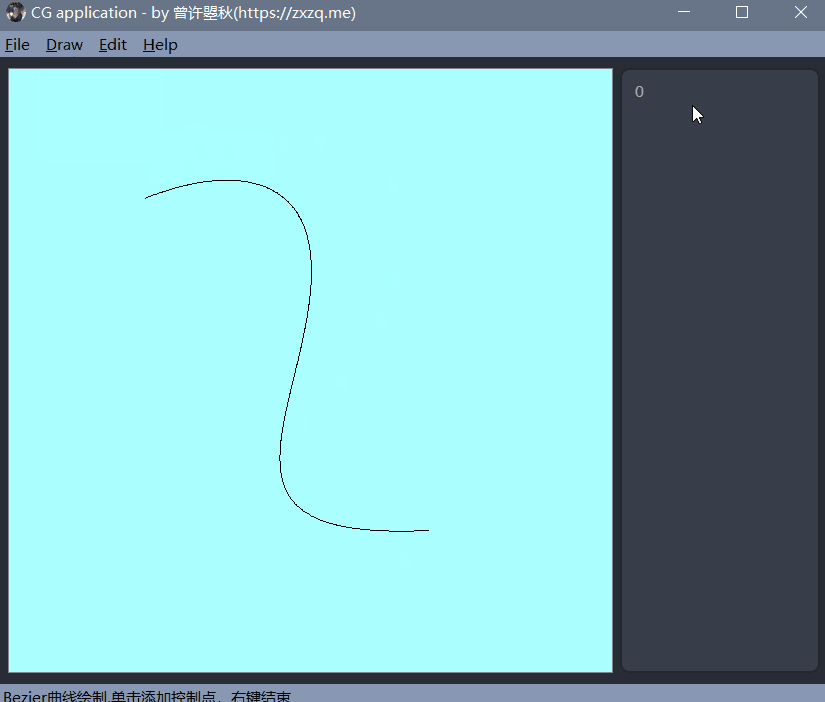
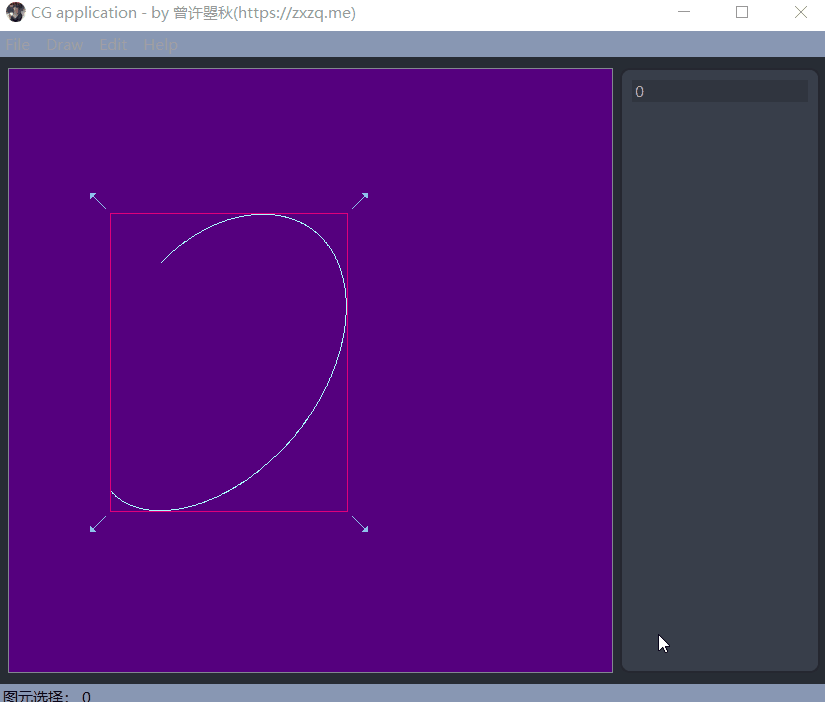

# MyCGProgram
> by [zxzq](https://zxzq.me)
> Spring 2021

## Description

This program is realized by [zxzq](https://zxzq.me) Spring 2021 during CG course at NJU. `cg_algorithm` includes basic algorithms applied to draw different graph (lines, polygons, ellipes, curves) and edit graph (translation, scaling, rotation). `cg_cli` interacts in shell while `cg_gui` interacts using pyqt5.

Other languages: [English](README.md), [Chinese](README.ch.md)

## Content

## Gui

### Draw

#### Line

#### Polygons
Click to start and each click add a vertex to p_list, right click to commit the last vertex.

#### ellipes

#### Curve

- Bezier
  

### Edit
Most editting function can be accessed both by menu (input para need) and by directly interacting after particular item selected.

#### Translation
- input dialogue

- direct interaction
  
  When point inside the bounding box is clicked (not released) after relative item is selected, the point will be record and p_list will be translated as mouse moving.

#### Rotation
Note: Rotation for Ellipse is not supported, see status bar.

#### Scaling
- input dialogue
- direct interaction
  
  Four arrows are drawn at each corner when relative item is selected. Scaling is triggered when mouse is pressed around the arrows.